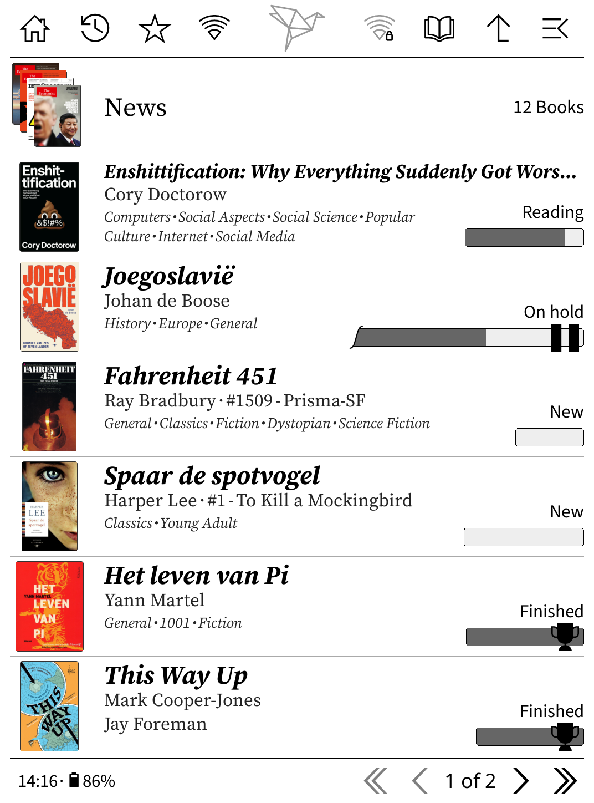

# KOReader patches

These are the user patches I use daily on my own [KOReader](https://github.com/koreader/koreader) install.
Feel free to use, copy or change them.
Install steps are here: [how to install user patches](https://koreader.rocks/user_guide/#L2-userpatches).

Helper script: `./deploy-patches.sh <host> [port]` uses SSH/SCP to copy all local `.lua` patches.

> [!WARNING]
> This script removes the current files in `/mnt/onboard/.adds/koreader/patches` on the target before copying.

> [!NOTE]
> Patches that start with 2-pt- only work with the [Project: Title](https://github.com/joshuacant/ProjectTitle) plugin.

## My patches

### [🞂 2-reader-footer-chapter-section](2-reader-footer-chapter-section.lua)

Adds section-aware items to the reader status bar:
- section progress
- section pages left
- section time to read
- section title

Goal: pin one status bar preset to chapter title + chapter progress, and another preset to section title + section progress.

Then use [2-statusbar-cycle-presets](#statusbar-cycle-presets) to switch between them while reading.
That gives you one status bar for general overview and one for the current section.

This screenshot shows all of that info together in one view:
[chapter title] [chapter pages/total in chapter] [empty space] [section pages/total in section] [section title]

### [🞂 2-pt-header](2-pt-header.lua)

Project: Title only.

Adapted local patch for the file browser title bar.

Mostly adapted by changing toolbar buttons and actions.

WireGuard plugin used by this setup:
[WireGuard plugin README](https://github.com/wtb04/wireguard.koplugin)

Sources:
- https://github.com/joshuacant/KOReader.patches/blob/main/2-toolbar-replace-button.lua
- https://github.com/joshuacant/KOReader.patches/blob/main/2-toolbar-add-buttons.lua

License: derived from AGPL-3.0 upstream code, see [AGPL-3.0.txt](LICENSES/AGPL-3.0.txt).

### [🞂 2-reader-header](2-reader-header.lua)

Adapted local patch for a simple reader header.

Current layout is title and author on the left, and time on the right.

Source:
https://github.com/joshuacant/KOReader.patches/blob/main/2-reader-header-cornered.lua

License: derived from AGPL-3.0 upstream code, see [AGPL-3.0.txt](LICENSES/AGPL-3.0.txt).

## Patches from other repos

### [🞂 2-kobo-style-sleepscreen-banner](https://github.com/zenixlabs/koreader-frankenpatches-public/blob/main/2-kobo-style-sleepscreen-banner.lua)

Restyles the built-in banner sleep screen so it looks more like a Kobo lockscreen with nice title screen.

Source:
https://github.com/zenixlabs/koreader-frankenpatches-public/blob/main/2-kobo-style-sleepscreen-banner.lua

### [🞂 2-pt-footer](https://github.com/joshuacant/KOReader.patches/blob/main/2-reader-footer-widgets.lua)

Project: Title only.

Trims Project: Title footer widgets down to a smaller set of items.

I only display clock and battery widgets.

Source:
https://github.com/joshuacant/KOReader.patches/blob/main/2-reader-footer-widgets.lua

### [🞂 2-statusbar-cycle-presets](https://github.com/sebdelsol/KOReader.patches/blob/main/2-statusbar-cycle-presets.lua)

Lets you cycle through your status bar presets by tapping the status bar.

Source:
https://github.com/sebdelsol/KOReader.patches/blob/main/2-statusbar-cycle-presets.lua

### [🞂 2-statusbar-thin-chapter](https://github.com/sebdelsol/KOReader.patches/blob/main/2-statusbar-thin-chapter.lua)

Adds chapter markers to the thin status bar.

Source:
https://github.com/sebdelsol/KOReader.patches/blob/main/2-statusbar-thin-chapter.lua

## License

Default license for this repo's original files: MIT, see [LICENSE](LICENSE).

Exception:
- 2-pt-header.lua is derived from AGPL-3.0 upstream code and remains under AGPL-3.0-or-later, see [AGPL-3.0.txt](LICENSES/AGPL-3.0.txt).
- 2-reader-header.lua is derived from AGPL-3.0 upstream code and remains under AGPL-3.0-or-later, see [AGPL-3.0.txt](LICENSES/AGPL-3.0.txt).

Made by [Wouter ten Brinke](https://woutertenbrinke.nl)